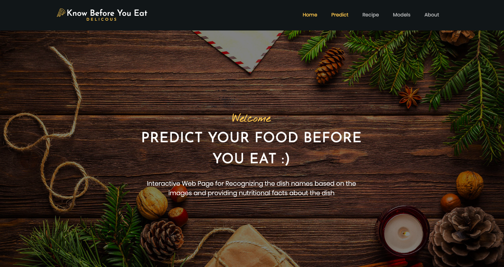

Project Description

KitchenSync is a Smart Kitchen Assistant that makes healthy eating easier, maximizes food usage, and streamlines inventory management. It's an online application.

Benefits include reducing food waste, boosting productivity, lowering expenses, improving nutrition, and encouraging a healthier way of life. The intended audience consists of home cooks who want to adopt healthier eating habits, people who have particular dietary requirements, and families looking for affordable and filling dinner options.

In the future, it might be possible to create customized recipes depending on dietary requirements and allergies, integrate AI-powered meal recommendations with smart kitchen appliances, and automatically cook meals.

